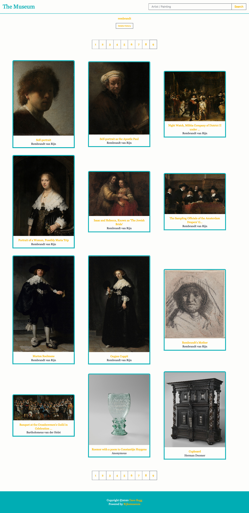

# CRA-MUSEUM
> The CRA-Museum App is developed by Dave Regg and built for those of us who cannot visit the Rijksmuseum in person. For that reason, users may search for an artist or painting, display search results, and get a close-up view of that painting with some details about the painting.

## Table of contents
* [General info](#general-info)
* [Screenshots](#screenshots)
* [Technologies](#technologies)
* [Setup](#setup)
* [Features](#features)
* [Status](#status)
* [Inspiration](#inspiration)
* [License](#license)
* [Contact](#contact)

## General info
The Museum Gallery is created and maintained by me, Dave Regg. It was created for the purpose of not only revamping the existing [Museum App](https://github.com/drregg6/museum-app) created in 2019, but to also make use of my [Create-React-App Boilerplate](https://github.com/drregg6/cra-redux-boilerplate) to see if everything works. The main purpose of The Museum Gallery is to give users an experience through the [Rijksmuseum API](https://rijksmuseum.nl), allowing them to search for an artist or painting and to get details of those paintings that are available through the API.

## Screenshots


## Technologies
* Node - version 12.3.1
* React - version 16.13.1
* Sass - version 1.26.5
* Axios - version 0.19.2
* Redux - version 4.0.5
* Redux-thunk - version 2.3.0
* Redux-devtools-extension - version 2.13.8

## Setup
1. Clone the repo
```sh
git clone https://github.com/drregg6/cra-museum.git
```
2. Install NPM packages
```sh
npm install
```
3. Retrieve an API key from [Rijksmuseum](https://www.rijksmuseum.nl)

## Features
List of features ready and TODOs for future development
* Search the expansive Rijksmuseum API
* Thumbnail images and details
* Search history

To-do list:
* Check for bugs
* Change the color scheme

## Status
Project is: The project is _launched_, located [on Heroku here](https://salty-hamlet-32931.herokuapp.com/), however there appears to be some bugs that need to be sorted out.

## Inspiration
The project is a inspired by [The Museum App](https://github.com/drregg6/museum-app) created by me in 2019

## License
Distributed under the MIT License. See `LICENSE` for more information.

## Contact
Dave Regg - [@daveregg](https://www.twitter.com/daveregg) - dave.r.regg@gmail.com

Project Link: [The Museum Gallery](https://salty-hamlet-32931.herokuapp.com/)